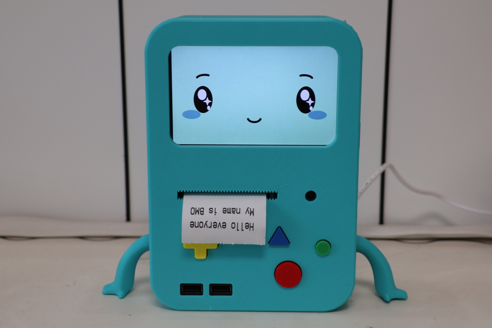

# BMO (Online AI Agent) 🤖

<p align="center">
  <strong>简体中文</strong> | <a href="README_EN.md">English</a>
</p>

<p align="center">
  
</p>

> 一个跑在树莓派 5 上的在线 AI 语音助手，接入多种模型，可随意切换，带网页控制台。
> 基于 [brenpoly/be-more-agent](https://github.com/brenpoly/be-more-agent)（本地版）改写。

## ✨ 特性

- **语音对话**：已支持接入 OpenAI、DeepSeek、OpenRouter、硅基流动等主流大模型服务。
- **看图能力**：摄像头拍照 → 视觉模型 描述
- **画图能力**：说"画一只戴帽子的猫" →  文生图模型生成 → 屏幕展示
- **搜索问答**：调用博查搜索接口，回答需要网络搜索/新闻类问题
- **唤醒词**：本地唤醒词模型 + **物理按钮 PTT** 两种触发，并存
- **网页控制台**（http://树莓派IP:8087）：在线切换音色 / 模型 / 性格 / 唤醒词，看日志、看历史、看画廊、当遥控器
- **保留 BMO 标志性脸部动画**

## 📦 硬件

### 所需硬件与购买参考

| 硬件 | 建议规格与用途 | 购买链接 |
|------|---------------|---------|
| 主机与存储 | Raspberry Pi 5（4GB）+ 32GB microSD 卡 | [淘宝](https://e.tb.cn/h.RuwD22edR018hL0?tk=86bUgkbUtMQ) |
| 树莓派 UPS | 为树莓派提供备用电源，避免意外断电；可选 | [淘宝](https://e.tb.cn/h.RFFLdcO73sdw4FF?tk=UjQ5gkbStMR) |
| 摄像头与转接线 | Raspberry Pi Camera Module v2；Pi 5 需要匹配的摄像头转接线 | [淘宝](https://e.tb.cn/h.RuZBVYKbpW7xVra?tk=M5iXgkbTtdC) |
| 显示屏 | 5 英寸 DSI 或 HDMI 显示屏，推荐 800×480 | [淘宝](https://e.tb.cn/h.Ru0ZikLlgCBdfeX?tk=zlQIgkbRKk4) |
| Pro Micro 开发板 | Type-C 接口、ATmega32U4；用于将物理按钮模拟成 USB 键盘输入 | [淘宝](https://e.tb.cn/h.Ru02Q9GnNil8q0D?tk=L2kpgkbOSuz) |
| 热敏打印机 | 58mm DP-628 热敏打印机 | [淘宝](https://e.tb.cn/h.REVjaCxwfApGJPR?tk=TuP6gkbN2dc) |
| 热敏打印纸 | 57mm 热敏打印纸，购买前确认与打印机兼容 | [淘宝](https://e.tb.cn/h.REVlbNcdRMRQ7VL?tk=Sy18gkbpbNR) |
| 扬声器 | USB 扬声器 | [淘宝](https://e.tb.cn/h.RFFCogWL3iJtNYL?tk=TL99gkbKLDw) |
| 麦克风 | USB 麦克风 | [京东](https://3.cn/-2U6HaT6?jkl=@GEuBQByEaVx5@) |
| Type-C 数据线 | 0.25 米，用于内部短距离连接 | [京东](https://3.cn/2U6Hnf-O?jkl=@A7B2GCKSv291@) |
| Type-C 公对母延长线 | 0.2 米，用于将接口延伸到机身外壳 | [京东](https://3.cn/2U6HD4-o?jkl=@EAwFV8UjHQZq@) |
| USB 一分为二转接线 | 用于扩展内部 USB 连接 | [淘宝](https://e.tb.cn/h.REVQoIRPfd4xsd3?tk=032IgkbM5Wg) |
| 带线微动开关 | 6×6×5mm，建议准备 7 个；带线款可简化安装 | [淘宝](https://e.tb.cn/h.RuDYggek1vOliYv?tk=Pyr9gkbQzmd) |
| 红黑杜邦线 | 若干，用于电源及信号连接 | [淘宝](https://e.tb.cn/h.Ru0Yxq7qP15ajhf?tk=eoJogkb8AhK) |
| M3 螺丝与螺母 | 若干，用于固定内部组件和外壳 | [淘宝](https://e.tb.cn/h.Ru0PUwo9d0YQHmy?tk=EIZZgkbvIEz) |

系统推荐使用 **Raspberry Pi OS 64-bit Desktop（Bookworm）**。

> **购买说明：**以上淘宝、京东链接来自项目硬件清单，仅作为型号和规格参考。商品库存、价格、套餐及链接有效期可能变化，请在下单前核对接口、尺寸、供电要求及配件数量。UPS 为可选组件；热敏打印机应使用独立供电，不要仅依赖树莓派供电。

> **免焊接按钮方案：**选择 Type-C 接口的 ATmega32U4 Pro Micro 和带线微动开关，即可通过 USB 模拟键盘输入，无需制作自定义 PCB。连接方式仍应根据实际端子和线材做好绝缘与固定。

## 🚀 安装

### 1. 在树莓派上烧好系统、连好网络

参考 [Raspberry Pi 官方 Imager 教程](https://www.raspberrypi.com/software/)。
烧录时**勾上 Enable SSH** + **配好 WiFi**，省去插键鼠的麻烦。

### 2. 拉代码

SSH 登录到你的树莓派。

进去之后拉代码：

```bash
git clone https://github.com/whykang/BMO-Online.git
cd BMO-Online
```

> **🇨🇳 中国大陆网络代理加速：
> ```bash
> git clone https://ghfast.top/https://github.com/whykang/BMO-Online.git
> cd BMO-Online
> ```

### 3. 一键安装

先加执行权限：

```bash
chmod +x setup_pi_cn.sh setup_pi_direct.sh
```

**中国大陆**（pip 走清华镜像、GitHub 走代理）：

```bash
./setup_pi_cn.sh
```

**其他地区**（纯直连，不走任何代理）：

```bash
./setup_pi_direct.sh
```

这一步会：
- apt 装系统依赖（python3-tk / portaudio / mpg123 / ffmpeg）
- 建 venv + 装 Python 包
- 检查唤醒词模型（仓库自带 `hey_bmo.onnx` + Sherpa-ONNX 中文 KWS）
- 创建 `.env`（如果不存在）

> 想指定自己的 GitHub 代理：`GH_PROXY="https://你的代理" ./setup_pi_cn.sh`。

### 4. （可选）热敏打印机：启用串口 UART

> 只有接了**热敏打印机**（走 GPIO 的 UART 引脚）才需要这步；**没有打印机直接跳到第 5 步**。

打印机通过树莓派的串口（UART）通信，但 Pi OS 默认**没启用硬件串口**，不开的话打印会报
`could not open port /dev/serial0 / No such file or directory`。

在树莓派上运行：

```bash
sudo raspi-config
```

进入 **Interface Options → Serial Port**，按提示回答这两个问题：

- **Would you like a login shell to be accessible over serial?** → 选 **No（否）**
  （关掉串口登录控制台，否则串口被系统占用、打印机用不了）
- **Would you like the serial port hardware to be enabled?** → 选 **Yes（是）**

选 **Finish** 退出并重启：

```bash
sudo reboot
```

重启后**直接给串口发一行字测试**（打印机吐纸就说明通了）：

```bash
printf 'BMO printer test\n\n\n' > /dev/ttyAMA0
```

> **Pi 5 注意**：GPIO 排针(8/10 脚)的 UART 是 **`/dev/ttyAMA0`**，
> 而 `/dev/serial0` 在 Pi 5 上指向的是**调试口 ttyAMA10**，不是排针！
> 所以默认 `printer.device` 用 `/dev/ttyAMA0`。如果上面这条不吐纸，把
> `/dev/ttyAMA0` 换成 `/dev/serial0` 再试，哪个吐纸就把它填进 `config.json` 的 `printer.device`。

**接线**：打印机的 RX / TX / GND 接到树莓派 GPIO 的 TXD(GPIO14, 物理8脚) / RXD(GPIO15, 物理10脚) / GND
（TX/RX 交叉，GND 必须共地）。打印机要**独立供电**（热敏打印瞬间 1.5~2A，别只靠树莓派带）。
波特率默认 9600（不吐纸可在 `config.json` 的 `printer` 段试 19200/115200；58mm 纸 `width=384`，80mm 改 `576`）。

### 5. 启动


```bash
./start_agent.sh
```

启动主程序时**会自动同时拉起 Web 控制台**。

>首次启动后，请在网页控制台的「API Key」中填写 API Key，并在模型列表中选择对应模型后即可使用。>

**浏览器打开** Web 控制台：

```
http://<树莓派 IP>:8087
```

不知道树莓派 IP？在ssh 终端跑：

```bash
hostname -I
```

> 如果你给树莓派设了 主机名（hostname）比如烧系统时填了 `bmo`，也可以用 `http://bmo.local:8087`。

## 🎮 使用

### 怎么唤醒 BMO

| 方式 | 操作 |
|------|------|
| 唤醒词 | 默认英文"hey bmo"(中文发音：“嘿，比目”），支持在网页里改成你想要的中文短语 |
| 物理按钮 | 短按 PTT 按钮（toggle 录音）|
| 网页遥控器 | 控制台 → 仪表板 → "开始录音" |

### 怎么打断 BMO

| 方式 | 操作 |
|------|------|
| 按住按钮 | 长按 PTT 按钮 ≥400ms（发空格）|
| 键盘 | 按空格键（GUI 窗口有焦点时） |
| 网页 | 控制台 → "打断说话" |

### BMO 能做什么（工具）

只要语音里隐含需求，LLM 会自己决定调用：

| 想做的事 | 怎么说 |
|---------|--------|
| 查时间 | "现在几点啦？" |
| 聊天 | "讲个笑话" |
| 拍照看 | "看看这是什么？" / "你能看见什么？" |
| 画图 | "画一只戴耳机的橙色小猫" |
| 查系统状态 | "看看系统状态" / "CPU 和温度怎么样？" |
| 隐身 | "隐身" / "退出隐身" |
| 玩游戏 | "打开坦克大战"|
| 播放音乐 | "播放音乐花海" |
| 搜索 | “今天北京天气怎么样” / "今天有哪些新闻" |
| 打印 | "打印近10条的对话内容" / "画一只猫并打印出来"|
| 清记忆 | "忘记一切" / "清空记忆" |
| 以及更多功能可以查看工具提示词|


## 🛠 网页控制台能做什么

| 标签 | 功能 |
|------|------|
| 仪表板 | 当前状态 + 快捷遥控 + 一键打印 |
| 音色 | 切换 Edge-TTS 音色（中/英/日）+ 试听 + 自定义 TTS 设置 |
| 模型 | 切换 LLM / Vision / STT / 文生图模型 |
| 性格 | 编辑 system prompt + 调记忆轮数 |
| 唤醒词 | 中文关键词文本输入（任意短语，零训练）/ 切引擎 / 调灵敏度 |
| 对话历史 | 查看 + 清空 |
| 图片画廊 | 看 BMO 画过的图、删除 |
| 游戏 | 上传游戏 + 启动/退出游戏 |
| 媒体 | 上传音乐/视频文件让bmo操控 |
| 遥控器 | 录音/打断/拍照按钮 + 让 BMO 说一句话 |
| 日志 | 实时日志流（SSE） |
| API Key | 看哪几个 provider 已配置、改 key |
| 安全 | 设置/取消网页后台访问密码 |


## 🎙 自定义中文唤醒词


### 几个调参建议

| 现象 | 怎么改 |
|------|--------|
| 误唤醒太多（说话总被打断） | 阈值调高（0.30 → 0.40），或选更生僻的关键词 |
| 唤不醒（怎么喊都没反应） | 阈值调低（0.25 → 0.18） |
| 中间的字总被吞 | 关键词得分调高（1.5 → 2.0） |
| 想加英文唤醒词 | 中英文都能加，例：`["你好小明", "hello bmo"]` |

### 引擎切换

| 引擎 | 适用 | 配置 |
|------|------|------|
| **OpenWakeWord** |（默认）英文，需训练 `.onnx` 模型 | 上传 .onnx，自带一个模型|
| **sherpa ** | 中文为主，可随意切换 | 无需自己训练模型|


## 🐛 排错

| 现象 | 解决 |
|------|------|
| `❌ 缺少 SILICONFLOW_API_KEY` | 检查 `.env` 文件 |
| 麦克风没反应 | `python -c "import sounddevice as sd; print(sd.query_devices())"` 看设备列表，把名字填进 `config.json` 的 `input_device` |
| TTS 没声音 | 检查 mpg123 是否装好：`which mpg123`；测试：`echo "hi" \| espeak` |
| 唤醒词不响应 | 网页里调低 threshold；检查录音音量 |
| 鼠标箭头还在屏幕上 | `sudo apt install unclutter xdotool` 后重启 BMO；Wayland 下会继续用 Tk 透明光标兜底 |
| 开机自启没生效 | 在网页「仪表板」重新开一次自启；现在会同时写入 systemd user、labwc autostart 和传统 desktop autostart |
| Web 控制台连不上 | 检查端口（`sudo ss -tlnp \| grep 8087`）、防火墙 |
| ALSA 错误一堆 | 正常的，无影响（树莓派音频驱动的小毛病） |

## 📚 项目结构

```
BMO-Online/
├── agent.py                # BMO 主程序（GUI + 状态机 + 流水线）
├── webui.py                # FastAPI Web 控制台
├── providers/              # API provider 抽象层
│   ├── llm.py
│   ├── stt.py
│   ├── vision.py
│   ├── tts_edge.py
│   ├── tts_siliconflow.py
│   └── image_gen.py
├── static/                 # Web 控制台前端（单文件 HTML）
│   ├── index.html
│   └── login.html
├── wakewords/              # Sherpa KWS 模型目录 + OpenWakeWord .onnx 模型库
├── firmware/               # Pro Micro 按钮固件
├── faces/                  # BMO 脸部动画（PNG 序列，需自备）
├── sounds/                 # 音效（.wav，需自备）
├── generated/              # AI 画的图（运行时生成）
├── logs/                   # 日志按天分文件
├── config.json
├── .env.example
├── requirements.txt
├── setup_pi.sh
├── start_agent.sh
├── start_webui.sh
└── sync.sh
```

## 🙏 致谢

- 原版 [Be More Agent](https://github.com/brenpoly/be-more-agent) by **brenpoly** — 整个项目的灵感和骨架来源
- [Sherpa-ONNX](https://github.com/k2-fsa/sherpa-onnx) — 中文唤醒词 KWS
- [OpenWakeWord](https://github.com/dscripka/openWakeWord) — 英文唤醒词引擎
- [Edge-TTS](https://github.com/rany2/edge-tts) — 微软 TTS 的 Python 封装
- BMO 角色版权归 Cartoon Network；本项目仅作非商业爱好

## 📄 许可证

MIT
